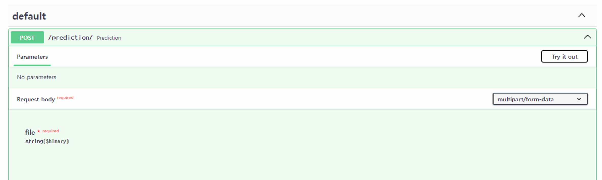

This folder is to practice the fastapi tutorial.

It just use simple pretrained resnet model and make API to use fastapi.


Install environment

```bash
pip install -r requirements.txt
```

Start fastAPI and evaluate model 

```bash
uvicorn main:app --reload 
```

Go to 

'''
ip address/docs 
'''


If you want to use docker 

```bash
docker build -t practice .
<<<<<<< HEAD
docker run -d -p 8000:8000 practice
```
=======
```

docker exec
>>>>>>> 7b11f31f05950efff6d394be2647ef273ee7023e
